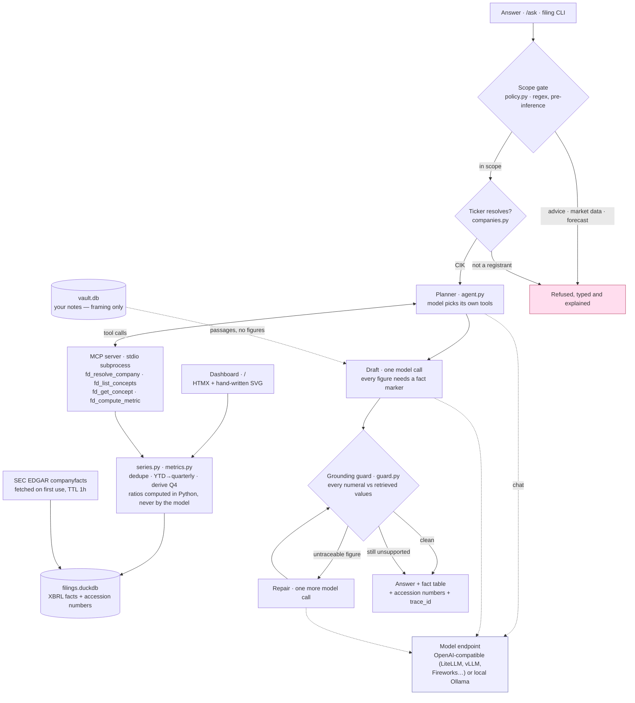

# Filing Desk

What public companies actually reported, from SEC filings, where **every figure is
retrieved from a specific filing and none are generated.**

Two surfaces over one data layer:

- **`/` — an interactive dashboard.** Search any of the ~10,400 SEC registrants,
  chart any line item they report, and read every number back to the filing it
  came from. No language model involved.
- **`/ask` — a grounded answer.** A local LLM narrates the same retrieved facts,
  and a deterministic guard strikes any figure that traces to nothing.

Runs on homelab CPU. No GPU, no hosted model. Filings are cached locally; the only
network call is to SEC EDGAR when a company is loaded or refreshed.

---

## What it does

The dashboard resolves a ticker against the SEC's own registrant list, pulls that
company's XBRL company facts on first use, and turns them into comparable series —
which is the part that is actually hard. Duplicates across filings are collapsed
(latest filed wins, which is also how restatements are handled), cumulative
year-to-date cash-flow figures are differenced back into quarters, the missing Q4
is reconstructed as `FY − (Q1+Q2+Q3)`, and anything reconstructed rather than filed
is marked as such on the chart, in the table, and in the answer.

Ask a question instead and the same facts go through MCP tools to a local model,
which may quote them but never compute them: ratios are calculated in Python, and a
guard re-checks every numeral in the draft against the retrieved values before it
is shown.

Out-of-scope questions are refused before the model sees them — investment advice,
market data and forecasts are explicit non-goals, enforced in code rather than
requested in a prompt.

### How a question moves through it

The two lanes are the whole design. The dashboard lane never reaches the model;
the answer lane reaches it twice, and everything it says is checked on the way
out against facts that were retrieved before it was asked to write anything.



Note where the model is *not*: it never touches the database, never computes a
ratio, and never decides whether a question is in scope. It chooses which tool to
call and it writes prose around numbers it was handed. A figure that survives to
the last box was retrieved from a filing, and one that was not is struck and
labelled rather than quietly dropped.

## Install and run

```bash
git clone https://github.com/nicholasbaillargeon-ux/Capstone.git && cd Capstone
cp .env.example .env && $EDITOR .env      # SEC_USER_AGENT needs a real email
```

With Docker:

```bash
docker compose up -d --build
```

Or directly:

```bash
python -m venv .venv && .venv/bin/pip install -r requirements.txt
cp .env.example .env && $EDITOR .env
./run.sh                                  # ./run.sh 9000 for another port
```

Then open **<http://localhost:8088/>** and search for a company. Nothing needs to be
seeded first — a company is fetched from EDGAR the first time it is asked for, and
refreshes itself on later loads once the cached copy is over an hour old.

To keep it running across crashes and reboots:

```bash
sudo cp deploy/filingdesk-native.service /etc/systemd/system/filingdesk.service
sudo systemctl daemon-reload && sudo systemctl enable --now filingdesk
```

The narrated answers at `/ask` need a model; the dashboard does not. With
`FD_LLM_PROVIDER=none` the health chip reads `dashboard only · no model` — stated
as a fact rather than a warning, because nothing on the dashboard is missing
without one.

### Choosing a model

Three options, and **the first is a complete configuration, not a degraded one**:

```bash
# dashboard only — the default posture on a memory-constrained box.
# /ask is switched off and says so; nothing else changes, because charts,
# figures, ratios and provenance never touch a model.
FD_LLM_PROVIDER=none

# local, nothing leaves the machine, wants ~5GB RAM for a 7B
FD_LLM_PROVIDER=ollama
FD_CHAT_MODEL=qwen2.5:7b-instruct-q4_K_M

# or any OpenAI-compatible endpoint — a self-hosted LiteLLM or vLLM proxy,
# Fireworks, Together, Groq, OpenRouter, llama.cpp's server, LM Studio
FD_LLM_PROVIDER=openai
FD_LLM_BASE_URL=https://litellm.example.internal/v1
FD_LLM_API_KEY=sk-...
FD_CHAT_MODEL=gpt-oss-120b
FD_EMBED_MODEL=                  # optional — see below
```

A proxy on the LAN is the interesting third case: the wire format is identical
to a hosted provider, so nothing in the app changes, but the traffic never
leaves the network. That is the deployment this was built against.

**Embeddings are optional.** They are used only to retrieve your own notes, and
plenty of endpoints serve chat without them — a LiteLLM proxy in front of vLLM
answers `/chat/completions` and returns 501 for `/embeddings`. Leave
`FD_EMBED_MODEL` empty in that case: notes are dropped from the prompt with a
warning and answers continue, because notes supply framing and never figures.
Nothing about grounding depends on them.

Settings live in `.env` and are read by every entry point — server, CLI, evals —
with the real environment taking precedence, so Docker and systemd override the
file rather than fight it.

The chat model **must support tool calling** — the agent picks its own data tools.
Instruct-tuned open-weights models generally do; base models do not.

### Speed vs accuracy

Reasoning models spend real wall clock thinking, and this app pays it two to
four times per question — once per planning step, once for the draft, once more
if the guard orders a repair. `FD_REASONING_EFFORT` sets that budget, and the
eval suite was used to pick the default rather than intuition:

| `FD_REASONING_EFFORT` | eval pass | median | worst |
|---|---|---|---|
| endpoint default | 13/15 | 34.4s | 95.2s |
| `low` | 12/15 | **14.0s** | **24.5s** |
| **`medium`** (default) | **14/15** | 31.1s | 70.5s |
| `plan=medium draft=low` | 11/15 | 24.5s | 82.5s |

`low` is more than twice as fast and genuinely worse: the draft starts rewriting
`64.78` as `0.6478` and `0.75` as `0.7500 b`. The guard catches these — that is
what it is for, and it is why the pass rate drops rather than wrong numbers
being shown — but a caught error still costs a repair round and sometimes the
answer. Careful transcription, not analysis, is what the budget buys here.

Set it per deployment. `FD_PLAN_REASONING_EFFORT` overrides the planning calls
alone if you want to tune the two halves separately; the last row is what
happens when you do it the obvious way.

```bash
FD_REASONING_EFFORT=low     # 14s answers, measurably sloppier
FD_REASONING_EFFORT=        # send nothing — for endpoints that reject the field
```

The parameter is dropped automatically, once per process, if the endpoint
rejects it, so a strict server degrades to its own default instead of failing
every request.

Hosted catalogues change faster than any default committed here, so the account is
the authority, not this file:

```bash
python -m filingdesk.models          # what can this key actually see?
python -m filingdesk.models --check  # is the configured model real and answering?
```

A wrong model ID is the most likely setup failure and the least legible one — the
provider returns "model not found" from inside a tool-calling loop, which the app
can only report as "the model could not be reached". `--check` names it directly.

State the tradeoff plainly: a hosted endpoint means the question and the retrieved
figures leave the machine, and "no network call at request time" stops being true.
**The grounding guarantee is unaffected** — retrieval, ratio computation and the
guard all run locally against locally cached filings, so a hosted model still
cannot introduce a number that is not in a filing. It can only phrase the ones it
was given, and anything else is struck.

Changing `FD_EMBED_MODEL` changes vector width, which invalidates the vault index.
Re-index after switching:

```bash
python -c "from filingdesk import vault, config; vault.index(config.VAULT_DIR)"
```

### Your own notes

`FD_VAULT_DIR` points at any directory of `.md` files — they supply *framing* only:
how you like a margin move described, what you consider noise. Notes never supply
figures. Every number still has to come from a filing and survive the guard, so a
note cannot smuggle a value into an answer.

Other surfaces:

```bash
python -m filingdesk.seed NVDA AAPL MSFT       # pre-load companies
filing report "How has gross margin moved?" --ticker NVDA
curl -s 'localhost:8088/api/company/NVDA?period=quarterly&limit=12' | jq
curl -s 'localhost:8088/api/companies/search?q=nvidia' | jq
curl -s localhost:8088/api/health | jq
```

To run with no Ollama and no network at all, add `--stub`. Fixtures are synthetic
and every page rendered in that mode says so.

## Three examples

**1. A question it can answer**

```
$ filing report "Show me gross profit for every quarter including Q4."

GrossProfit was $45,079,000,000 [[fact:8]] in the most recent period,
against $16,720,000,000 [[fact:1]] at the start of the series.

**Derived, not filed.** 2 quarters in this answer (2025-01-26, 2026-01-25)
appear in no filing. No company files a 10-Q for Q4, so it is computed as
the fiscal year minus Q1–Q3.

SOURCES
[[fact:1]] GrossProfit = 16,720,000,000 (period ending 2024-04-28, 0001045810-24-000000)
...
[[fact:8]] GrossProfit = 45,079,000,000 (period ending 2026-01-25, 0001045810-26-900001)  [derived]

  8 facts · 0 unverified · 1.0s · 19FB3EBEA1D7E8DA61E82
```

Every figure carries an accession number. Two of the eight quarters are computed
rather than filed, and the answer says so without being asked.

**2. A question it refuses**

```
$ filing report "Should I buy NVDA stock?"

Out of scope — investment advice

Filing Desk does not give investment advice — no recommendations, price
targets, or valuation opinions. It reports what a company filed and how the
numbers moved. Ask what a figure was, or how it changed, and you can draw
your own conclusion.

  no answer produced · out_of_scope_advice · 19FB3EB3CE1D616284543
```

This is decided before any inference runs. The model is never asked to decline.

**3. A question it can't answer, answered honestly**

```
$ filing report "How has gross margin moved?" --ticker ZZZZ

No such ticker

That symbol is not in the SEC's registrant list, so there are no filings to
read. Check the ticker, or search by company name. Closest matches: ZZ, ZZZ.

  no answer produced · unknown_ticker · 19FB3E8555EC35A5089EA
```

"Not a registrant", "registrant with no XBRL", "company never reported that
figure" and "EDGAR is unreachable" are four different refusals with four
different fixes, and the message says which one happened. A registrant that
simply hasn't been loaded yet is not a refusal at all — it is fetched.

## Known limitations

Stated plainly, because a demo that hides these is worse than one that doesn't.

- **Derived quarters inherit the accession number of the filing they were
  computed from.** A reconstructed Q4 appears in no document, but points at the
  10-K it was derived from. It is flagged `derived` everywhere it appears and
  carries its own derivation string, so nothing is hidden — but the provenance
  model still points a computed figure at a document.
- **Concept coverage is a hand-written alias map.** ~30 logical concepts across
  the income statement, cash flow and balance sheet, each mapping several
  us-gaap tags. Wide enough for mainstream operating companies; a filer using an
  unmapped tag reports `no_concept_data` rather than guessing. Financials and
  REITs fare worst — a bank has no "gross profit," and the dashboard correctly
  offers fewer metrics for JPM than for NVDA.
- **Segment data is not fully filtered out.** Consolidated totals and per-segment
  breakouts share a concept tag and differ only by XBRL dimensions, which the
  companyfacts API does not expose. Same-period duplicates within one filing are
  resolved by taking the largest, which is the consolidated figure — a heuristic,
  not a guarantee.
- **The ticker file is the SEC's, including its surprises.** After a
  holding-company reorganisation the ticker points at the new registrant, which
  may have no XBRL history at all, while the operating company's filings stay
  under a predecessor CIK carrying no ticker. `XOM` is currently exactly this;
  the app says so and lets you load the predecessor by CIK.
- **The scope gate is regex.** It catches the obvious phrasings of advice, price
  and forecast questions. It will miss creative ones, and the tests are mostly
  about making sure it doesn't block legitimate questions.
- **The grounding guard's number matching is heuristic.** Multiple readings of
  each token with 0.5% tolerance. It rejects fabricated figures reliably in
  testing; it will also occasionally reject a correct one.
- **Narrated answers are slow and optional.** Median 31s, worst case 70s across
  the eval suite on a self-hosted gpt-oss-120b, streamed as stages rather than a
  spinner. Roughly two thirds of that is the planning loop rather than the
  writing. The dashboard does not use the model at all and is not affected.
- **No tests on retrieval quality itself.** Precision@5 is a stated success
  criterion with no harness behind it yet.

## Where to read next

| | |
|---|---|
| [`spec.md`](spec.md) | Problem, constraints, interfaces, criteria, open questions |
| [`docs/adr/`](docs/adr/) | Two-lane grounding; why two storage engines |
| [`evals/`](evals/) | 15 cases and the harness that grades them |
| [`docs/FINDINGS.md`](docs/FINDINGS.md) | What each build day disproved |
| [`docs/deploy.md`](docs/deploy.md) | Deploy, reboot test, log queries |
| [`docs/questions.md`](docs/questions.md) | The smoke-test question set |

## Stack

Charts are hand-written SVG with no chart library and no CDN, on a
colourblind-validated three-slot categorical palette, with a table view behind
every chart. Any OpenAI-compatible endpoint (a self-hosted LiteLLM proxy in
front of gpt-oss is the reference deployment) or local Ollama · DuckDB over
Parquet for filings · `sqlite-vec` for notes, with a numpy fallback ·
self-written MCP server over stdio · FastAPI · Docker · Caddy · systemd ·
Gitea Actions. All open source, all local.

MIT.
