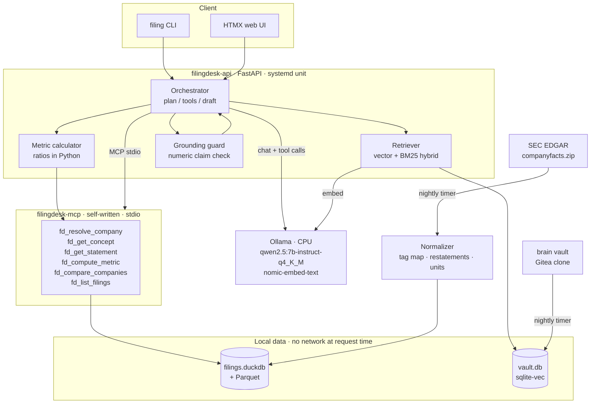
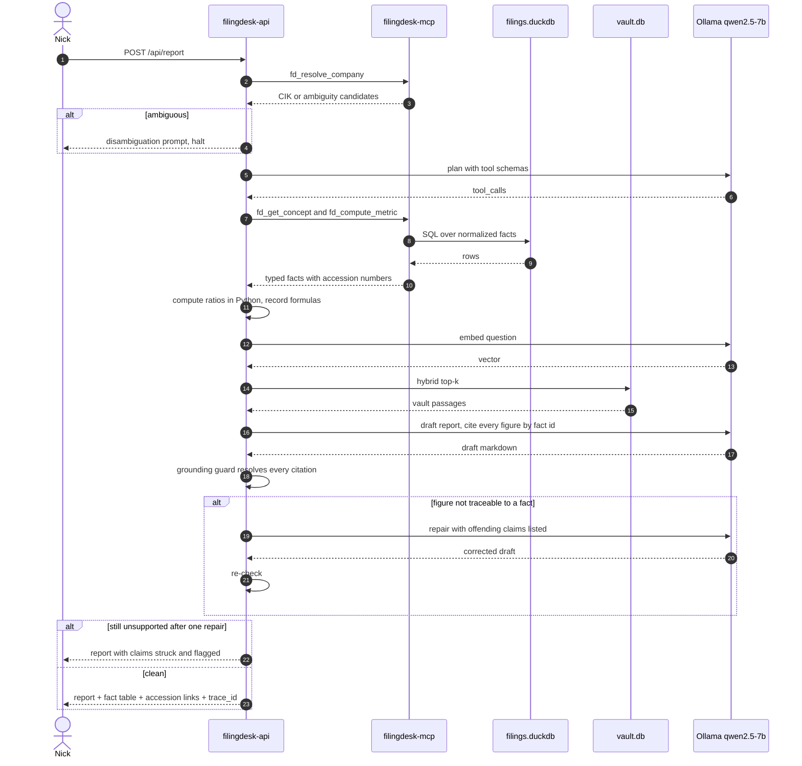

# Filing Desk — Spec

**Status:** amended after the eval harness · **Rev:** 6
Rev 3 was tagged `spec-locked`. Rev 4 records what the skeleton disproved.
Changes are marked **[skeleton]** and explained in [`docs/FINDINGS.md`](docs/FINDINGS.md).

---

## Problem

Reading a company's numbers properly means opening several filings, finding the same
line item in each, checking whether prior periods were restated, and re-deriving ratios
I already know how to derive. It takes twenty minutes to answer a question I could
describe in one sentence, and the tedium means I often don't bother.

General-purpose LLMs make this worse rather than better. Ask one for a company's gross
margin last quarter and it will produce a plausible, confidently-wrong figure. For
financial work a fabricated number is worse than no answer — it survives review because
it looks exactly like a real one, and it silently contaminates every calculation
downstream.

Filing Desk answers questions about what companies actually reported, where **every
figure is retrieved from a specific XBRL fact in a specific filing, never generated**,
and the analytical framing comes from my own notes rather than the model's priors.

## Users

- **Primary: me.** Weekly, more during earnings season. If I stop opening it in
  November, it failed.
- **Secondary: a hiring manager**, reading the repo without running it. Needs the
  README and ADRs to demonstrate engineering judgement in about five minutes.

No third user. No auth, no accounts, no multi-tenancy.

## Constraints

**Hardware.** Homelab, CPU-only. No GPU. This is the binding constraint and it drives
model size, quantization, context budget, and the latency targets below.

**Model.** `qwen2.5:7b-instruct-q4_K_M` via Ollama. Apache 2.0. Selected for
tool-calling reliability at a size CPU inference can serve — see ADR-0001.
Embeddings: `nomic-embed-text` (768-dim), same runtime.

**Data.** SEC EDGAR XBRL. No API key required, but the SEC enforces 10 requests/second
per IP and requires a descriptive `User-Agent` carrying a contact email — both are
non-negotiable and a violation gets the homelab IP blocked. **The application makes no
network call during a request.** Every query is served from local disk.

**[skeleton]** Two ingest paths, not one. The bulk archive `companyfacts.zip` is for
seeding a full watchlist; adding a single company uses the per-company API, which is one
request against a ~1 GB download. Rev 3 specified bulk only, which made the first
company needlessly expensive.

**Storage.** `filings.duckdb` over Parquet for the facts cache; `vault.db` with
`sqlite-vec` for the note index. Two engines, deliberately — see ADR-0002.

**Corpus.** The `brain` vault, cloned from Gitea, chunked and embedded.

**MCP.** `filingdesk-mcp` is written by me. Python MCP SDK, stdio transport, all tools
`readOnlyHint: true`, names prefixed `fd_`, Pydantic input *and* output schemas.

**[skeleton]** **Nothing in the server process may write to stdout.** Under stdio
transport, stdout *is* the JSON-RPC channel, and a stray `print()` corrupts the stream
mid-session. This binds every module the server imports, not just the server file. All
server-side logging goes to stderr.

**[skeleton]** The SDK renamed `FastMCP` to `MCPServer` in 2.x and `inputSchema` to
`input_schema`. The client and server both carry a two-line compatibility shim.

**[deploy]** **Tool calls are validated in three layers before execution** —
structural, schema, and semantic. The third checks the call against the request that
was actually made: a schema-perfect `fd_compute_metric(ticker="AMD")` on an NVDA
question returns real numbers for the wrong company, which the grounding guard cannot
catch. Rejections return to the model as a JSON hint, bounded at 3 per request.

**Deployment.** Docker Compose behind Caddy, autostarted by a systemd unit, with
Gitea Actions CI running ruff, mypy strict, and pytest.

**[deploy]** Specifics that are now load-bearing rather than incidental:
- Multi-stage image on `python:3.12-slim`; runs as a non-root user at a **fixed uid
  (10001)** so the data volume's ownership survives rebuilds.
- Container port is published to **loopback only**; Caddy is the sole ingress.
- **Ollama stays on the host.** CPU inference gains nothing from a container and the
  model cache already lives on the host.
- The healthcheck asserts *data readiness*, not liveness: it fails while the volume
  is empty, so a container with no facts never goes healthy and Caddy never routes to
  it. A 200 that means nothing is worse than no healthcheck.
- Logs go to journald with `CONTAINER_TAG=filingdesk`.

**[deploy]** **Everything that must survive a restart lives on one named volume**
(`/data`): the filings cache, the vector index, conversation history, and eval
results. The vault is mounted read-only — Gitea is its source of truth.

**[deploy]** **The MCP SDK does not pass the parent environment to the server
subprocess.** It starts from a minimal safe set, so `FD_ROOT` and friends must be
forwarded explicitly. Left unfixed in a container, the server opens an empty database
at a default path and every request refuses while the API still reports healthy — a
silent, total failure. See `PASS_ENV` in `agent.py`.

**Scope of coverage.** US filers, `us-gaap` taxonomy, 2015 onward. IFRS is out.

## Non-goals

- **Not investment advice.** No recommendations, price targets, valuations, or
  buy/sell/hold framing. Filing Desk describes what was reported and how it moved.
  **[evals]** Rev 5 said the *prompt* would refuse these. The eval showed it did not —
  asked "Should I buy NVDA stock?", the system produced a report. This is now a
  deterministic scope gate (`policy.py`) that runs **before any inference**, covering
  advice, market data, and forecast questions. A system prompt is a request; a policy
  boundary has to be code.
- **No market data.** No prices, quotes, volume, or market cap. Filings only. This
  keeps the provenance model clean: every number has an accession number behind it.
- **Not a forecast.** Descriptive and historical only. No projections, no consensus
  estimates.
- **Not a screener.** Question-driven, not a "find me all companies where X" engine.
  That's a different tool with different data requirements.
- **Not a chatbot.** Single-turn question → report. No conversational memory.
- **No fine-tuning.** Prompting, retrieval, and tool design only.
- **No reranker in v1.** `bge-reranker-base` on CPU costs more latency than the
  retrieval quality is worth at this corpus size. Revisit if precision@5 is the
  bottleneck.

## Interfaces

### HTTP (FastAPI)

| Method | Path | Purpose |
|---|---|---|
| `POST` | `/api/report` | `{company, question, periods?}` → grounded write-up |
| `GET` | `/api/health` | liveness + last-index and last-EDGAR-refresh timestamps |
| `GET` | `/` | HTMX single-page UI, streams per-stage status |

`POST /api/report` returns:

```json
{
  "trace_id": "01J...",
  "report_md": "...",
  "facts": [
    {"id": 1, "concept": "GrossProfit", "taxonomy": "us-gaap",
     "value": 26670000000, "unit": "USD", "fy": 2025, "fp": "Q3",
     "period_end": "2025-10-26", "form": "10-Q",
     "accn": "0001045810-25-000167", "filed": "2025-11-19",
     "restated": false, "tool": "fd_get_concept"}
  ],
  "derived": [
    {"id": 7, "metric": "gross_margin", "value": 0.734,
     "formula": "GrossProfit / Revenues", "inputs": [1, 2]}
  ],
  "passages": [{"path": "brain/finance/reading-margins.md", "score": 0.81}],
  "unsupported_claims": [],
  "latency_ms": {"plan": 4100, "tools": 140, "retrieve": 300, "draft": 38000}
}
```

`facts` plus `derived` is the contract that makes the whole thing auditable. Every
figure in `report_md` must resolve to one of them, and every fact carries the accession
number of the filing it came from — so any claim can be checked against the source
document in one click.

Derived metrics are computed **in Python, not by the model**, and return their formula
and input fact ids. A ratio the model calculates in its head is a hallucination with
extra steps.

### MCP tools (`filingdesk-mcp`)

| Tool | Input | Output |
|---|---|---|
| `fd_resolve_company` | `query` | CIK, ticker, name, + candidates when ambiguous |
| `fd_get_concept` | `cik`, `concept`, `unit`, `periods` | fact time series with full provenance |
| `fd_get_statement` | `cik`, `statement`, `periods` | normalized income statement / balance sheet / cash flow |
| `fd_compute_metric` | `cik`, `metric`, `periods` | derived ratio + formula + input facts |
| `fd_compare_companies` | `ciks[]`, `metric`, `period` | aligned table, flags non-comparable tagging |
| `fd_list_filings` | `cik`, `form`, `since` | filing metadata + accession numbers |

Every fact output carries `accn`, `form`, `fy`, `fp`, `period_end`, `filed`, the exact
`concept` tag used, `unit`, and a `restated` flag. Provenance is not optional metadata —
it is the product.

`fd_compare_companies` returns a comparability warning when two filers used different
tags for the same line item. Presenting those side by side without a flag would be the
most dangerous kind of quiet error.

### Logging  **[deploy]**

Structured JSON via `structlog` to stdout, captured by journald. One ULID `trace_id`
per request, bound once and emitted on every line. Events: `request.start`,
`mcp.connected`, `tool.call`, `tool.rejected`, `tool.error`, `tool.empty`,
`tool.crashed`, `plan.done`, `retrieve`, `guard`, `request.refused`, `request.end`.
Every tool call is logged with its arguments, duration, and how many facts it
contributed. Prompts and report bodies are not logged.

Success criteria 4 and 6 are `journalctl | jq` one-liners against these events —
see [`docs/DEPLOY.md`](docs/DEPLOY.md).

### Quarterly series construction  **[skeleton]**

Rev 3 treated "eight quarters of a concept" as a retrieval problem. It is a
reconstruction problem, and this is now specified rather than assumed:

1. **Classify by duration, not by `fp`.** The `fp` field describes the period of the
   *filing*, not of the fact — a single 10-Q carries 3-month, 9-month, and prior-year
   comparative facts under the same `fp`. Periods are classified from `start`/`end`
   day-counts: 80–100 days is a quarter, 340–380 is a fiscal year, everything else
   (6-month and 9-month cumulatives) is dropped. Skipping this double-counts revenue.
2. **Dedupe by period, latest `filed` wins.** The same period appears in many filings.
   The most recently filed value is authoritative, which is also how restatements are
   handled. A period with more than one distinct filed value is flagged `restated`.
3. **Derive Q4.** No company files a 10-Q for Q4, so no Q4 fact exists. It is computed
   as `FY - (Q1+Q2+Q3)` and flagged `derived`. **In an eight-quarter series, two
   quarters are computed rather than filed**, and the report must say so.

### CLI

```bash
filing report NVDA "how has gross margin moved over 8 quarters?"
filing compare NVDA AMD --metric gross_margin --period 2025Q3
filing index --vault ~/brain          # rebuild embeddings
filing refresh --since 2026-01-01     # incremental EDGAR pull
filing seed --bulk                    # one-time companyfacts.zip load
```

## Architecture

### Component



### Sequence



The repair loop runs **at most once**. A second failure is surfaced, not retried —
looping until the model produces something that passes would optimize for satisfying
the check rather than being correct, which is the exact failure the check exists to
prevent.

## Success criteria

Measured, not vibes. All figures below are on the homelab, CPU, cold cache.

1. **Zero ungrounded figures.** On a 25-question eval set, `unsupported_claims` is
   empty in ≥ 24/25 after at most one repair. Primary criterion — failing it fails the
   project regardless of everything else.
2. **Concept resolution accuracy ≥ 90%.** On 30 hand-checked company/metric pairs
   deliberately spanning filers who tag the same line item differently, the normalizer
   selects the correct XBRL concept. This is the domain-specific criterion and the one
   most likely to be quietly hard.
3. **Restatement and derivation handling: 100% on a 10-case set.** Includes derived
   Q4 correctness against a hand-computed value. When a prior period was restated,
   the reported figure is the restated one and the report says so. Silently returning a
   superseded number is a correctness bug, not a presentation issue.
4. **Tool-call validity ≥ 95%.** Across 100 runs the model emits a schema-valid call
   naming an existing tool. Malformed calls are logged, not silently retried.
5. **Retrieval precision@5 ≥ 0.6** against 20 hand-labelled question/passage pairs.
6. **p95 end-to-end ≤ 90s**, first token ≤ 15s. Slow is acceptable on CPU; silent is
   not — the UI streams status through each stage.
7. **MCP eval suite: 10/10.** Ten realistic, independent, read-only, verifiable
   questions answered correctly through the tools alone.
8. **Refuses rather than fabricates. [deploy]** When no tool covers the question, or
   the company has no loaded data, the service returns an explicit refusal with no
   report body. Verified by smoke questions 4 and 5, which exist to be unanswerable.
9. **Refuses for the right reason. [evals]** Refusals are typed
   (`out_of_scope_advice`, `no_company_data`, `no_concept_data`, …) and the eval
   asserts the *kind*, not just that something was declined. "It broke" and "that is
   out of scope" are different answers.
10. **Provenance flags reach the reader. [evals]** Derived and restated figures are
   disclosed in the answer, generated in code from the fact flags rather than
   requested in the prompt.
11. **Survives a reboot.** Container autostarts, healthcheck goes healthy, and the
   filings cache, vector index, and history are all still on the volume.
   `deploy/verify-reboot.sh` is the test.
12. **Cold start reproducible.** `git clone` → documented commands → working service on
   a clean machine, verified end to end once. CI green: ruff, mypy strict, pytest.

## Open questions

1. ~~**Citation syntax vs. numeral extraction.**~~ **Resolved by the skeleton: both.**
   Citations alone fail — the model will put a valid `[[fact:N]]` next to a wrong
   number. Numeric matching alone fails — there is no way to know which fact a figure
   was meant to come from. The guard requires a citation in the sentence *and*
   independently verifies the numeral, accepting multiple readings of each token
   (`$45,079M`, `73.9%`, `0.739`) with 0.5% tolerance. First false positive in
   practice was ISO dates tokenizing into `2024`, `04`, `28`; dates are now masked
   before scanning. Expect more of these — each one rejects a correct report.
   **Whether the 7B model reliably emits the markers at all is still untested**; the
   skeleton faked that half.
2. **How bad is the tag heterogeneity, really?** `Revenues` vs
   `RevenueFromContractWithCustomerExcludingAssessedTax` is the well-known case, but I
   don't know the true distribution across my watchlist. A hand-built tag map may cover
   90% of what I actually ask about, or it may be a swamp. **Sample 20 companies before
   committing to a normalization design** — this determines whether criterion 2 is
   achievable.
3. **Dimensional axes.** Many facts are reported both in total and broken out by
   segment or geography under the same concept, distinguished only by XBRL dimensions.
   Naively querying by concept alone will silently sum or double-count. v1 probably
   filters to consolidated totals only — but "probably" needs to become a decision.
4. **Does the vault have enough finance content?** Retrieval quality is capped by
   corpus quality. If precision@5 is low because my notes on reading statements are
   thin, that's a writing problem, not a retrieval problem. Check before blaming the
   retriever.
5. **7B vs 3B.** Is `qwen2.5:3b-instruct` tool-calling reliable enough to halve latency?
   Testable in an afternoon against criterion 4. Deferred until the eval set exists.
6. **The semantic entity check is a crude heuristic. [deploy]** It compares the
   requested ticker against a set built from the request field and uppercase tokens in
   the question. It already produced one false rejection (ticker supplied as a field,
   absent from the text) and will produce more — a question mentioning a peer company
   in passing would let a call through for the wrong one. It needs to become entity
   resolution rather than string matching, but not before `fd_resolve_company` exists.
7. ~~**"No tool for this" and "no data for this" look identical.**~~ **Resolved
   [evals]:** tools return a typed `error_kind`, `fd_list_concepts` reports what a
   company actually has, and the agent maps the kind to a distinct refusal message.
8. **The scope gate is regex. [evals]** It catches the obvious phrasings and is
   tested mainly for false positives, since a blocked legitimate question is
   invisible to the user. It will miss creative phrasings. Intent classification is
   the eventual answer, but not on a 7B model that would itself need guarding.
9. **Derived quarters have borrowed provenance. [skeleton]** A derived Q4 currently
   inherits the 10-K's accession number, which is misleading — that figure appears in
   no filing. Derived facts need their own provenance shape, citing the input facts
   they were computed from rather than a document reference they don't have. This
   partially undercuts the "every number points at a filing" claim in the README, so
   it needs fixing before that claim is made publicly.
